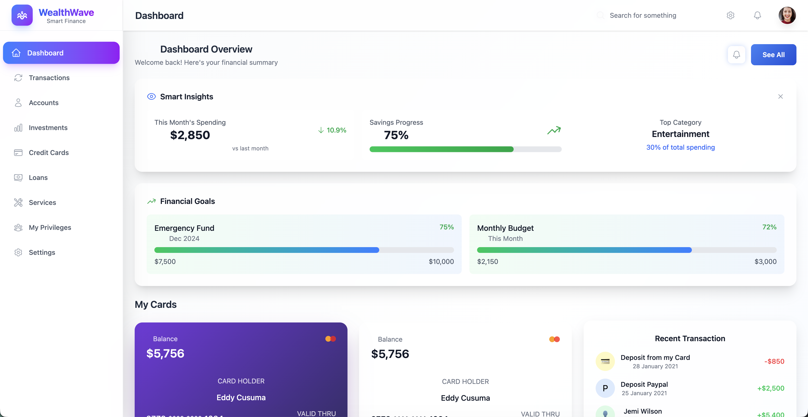

# WealthWave - Smart Financial Dashboard

A modern, high-performance financial dashboard built with React, TypeScript, and cutting-edge web technologies. WealthWave provides an enterprise-grade user experience with comprehensive accessibility, smart insights, and intuitive financial management tools.

[🚀 Live Demo](https://bugracinbat.github.io/financial-dashboard/)



## ✨ Key Features

### 📊 **Interactive Dashboard**
- Real-time financial overview with smart insights
- Enhanced balance history with trend analysis
- Weekly activity metrics with period selectors
- Expense statistics with category breakdown and budget alerts

### 🎨 **Modern User Experience**
- Glass-morphism design with smooth animations
- Enhanced navbar with profile dropdown and notifications
- Smart search with suggestions and filtering
- Smooth page transitions and loading states
- Toast notification system

### ⚡ **Performance Optimized**
- Code splitting with lazy-loaded components
- Optimized bundle size (~219KB gzipped)
- Skeleton loading screens for better perceived performance
- Real-time performance monitoring in development

### ♿ **Accessibility First (WCAG 2.1 AA)**
- Screen reader support with ARIA labels
- Keyboard navigation with shortcuts
- Skip links and focus management
- High contrast and reduced motion support
- Semantic HTML structure

### 💼 **Financial Management**
- 💳 Advanced transaction management
- 👤 Comprehensive account overview
- 📈 Investment portfolio tracking
- 💰 Credit card and loan management
- 🛠 Service and privilege tracking

### ⌨️ **Power User Features**
- Keyboard shortcuts (Ctrl+D for Dashboard, etc.)
- Quick transfer with user suggestions
- Advanced search functionality
- Dark mode ready

## 🛠 Tech Stack

### **Core Technologies**
- **React 18** - Modern React with Hooks and Suspense
- **TypeScript** - Full type safety
- **Vite** - Lightning-fast build tool
- **Tailwind CSS** - Utility-first styling

### **Libraries & Tools**
- **React Router** - Client-side routing with code splitting
- **Chart.js** - Interactive data visualizations
- **Heroicons** - Beautiful SVG icons
- **React Chartjs-2** - React wrapper for Chart.js

### **Performance & UX**
- **React.lazy()** - Dynamic imports for code splitting
- **Suspense** - Loading state management
- **Error Boundaries** - Graceful error handling
- **Custom Hooks** - Reusable state logic

## 📁 Project Structure

```
financial-dashboard/
├── src/
│   ├── components/         # Reusable UI components
│   │   ├── Charts/        # Chart components (lazy-loaded)
│   │   ├── LoadingStates/ # Skeleton screens
│   │   ├── ErrorBoundary.tsx
│   │   ├── KeyboardShortcuts.tsx
│   │   ├── PageTransition.tsx
│   │   ├── ToastNotification.tsx
│   │   └── TransferModal.tsx
│   ├── hooks/             # Custom React hooks
│   │   └── usePerformanceMonitor.ts
│   ├── layouts/           # Layout components
│   │   └── MainLayout.tsx # Enhanced navbar & sidebar
│   ├── pages/             # Page components (lazy-loaded)
│   │   ├── Dashboard.tsx  # Enhanced dashboard
│   │   ├── Transactions.tsx
│   │   ├── Accounts.tsx
│   │   └── ...
│   ├── styles/            # CSS files
│   │   └── accessibility.css
│   ├── App.tsx            # Main app with providers
│   └── main.tsx           # Entry point
├── public/                # Static assets
├── vite.config.ts         # Optimized build config
└── package.json           # Dependencies
```

## 🚀 Getting Started

### **Prerequisites**
- **Node.js** 18.x or later
- **npm** 8.x or later

### **Quick Start**

1. **Clone the repository**
```bash
git clone https://github.com/bugracinbat/financial-dashboard.git
cd financial-dashboard
```

2. **Install dependencies**
```bash
npm install
```

3. **Start development server**
```bash
npm run dev
```

4. **Open in browser**
   - Navigate to [http://localhost:5173](http://localhost:5173)

### **Available Scripts**

```bash
npm run dev      # Start development server
npm run build    # Production build
npm run preview  # Preview production build
npm run lint     # Run ESLint
```

## 📦 Production Build

### **Build Optimization**
- Code splitting into optimized chunks
- Lazy loading for better performance
- Tree shaking to eliminate unused code
- Asset optimization and compression

```bash
npm run build
```

**Build Output:**
- Main bundle: ~66KB gzipped
- Chart components: Separate chunk
- Page components: Individual chunks
- Vendor libraries: Optimized chunks

## 🌐 Deployment

### **Vercel (Recommended)**
1. Connect your GitHub repository to [Vercel](https://vercel.com)
2. Vercel auto-detects Vite configuration
3. Deploy with zero configuration

### **Manual Deployment**
```bash
# Build the project
npm run build

# Deploy the dist/ folder to your hosting provider
```

### **GitHub Pages**
The project is configured for GitHub Pages deployment with proper base path handling.

## ⌨️ Keyboard Shortcuts

| Shortcut | Action |
|----------|--------|
| `Ctrl/Cmd + D` | Dashboard |
| `Ctrl/Cmd + T` | Transactions |
| `Ctrl/Cmd + A` | Accounts |
| `Ctrl/Cmd + I` | Investments |
| `Ctrl/Cmd + S` | Settings |
| `?` | Show help |
| `Esc` | Close modals |

## 🎯 Performance Features

### **Code Splitting**
- Automatic route-based splitting
- Component-level lazy loading
- Optimized vendor chunk separation

### **Loading States**
- Skeleton screens for better UX
- Context-aware loading indicators
- Smooth transitions between states

### **Error Handling**
- Global error boundaries
- Graceful degradation
- User-friendly error messages

## ♿ Accessibility Features

### **Keyboard Navigation**
- Full keyboard support
- Skip links for screen readers
- Focus management in modals

### **Screen Reader Support**
- ARIA labels and descriptions
- Live regions for dynamic content
- Semantic HTML structure

### **Visual Accessibility**
- High contrast mode support
- Reduced motion preferences
- Scalable text and interfaces

## 🧪 Browser Support

- **Chrome** 90+
- **Firefox** 88+
- **Safari** 14+
- **Edge** 90+

## 📊 Bundle Analysis

| Component | Size (gzipped) |
|-----------|----------------|
| Main bundle | ~66KB |
| Chart components | ~16KB |
| Page routes | ~4-17KB each |
| Vendor libraries | ~65KB |

## 🤝 Contributing

We welcome contributions! Please see our [Contributing Guidelines](CONTRIBUTING.md) for details.

### **Development Workflow**
1. Fork the repository
2. Create a feature branch (`git checkout -b feature/amazing-feature`)
3. Make your changes with proper TypeScript types
4. Add tests if applicable
5. Ensure accessibility compliance
6. Commit with conventional commits
7. Push and create a Pull Request

### **Code Standards**
- TypeScript for type safety
- ESLint for code quality
- Accessibility-first development
- Performance-conscious coding

## 📝 Changelog

See [ENHANCEMENTS.md](ENHANCEMENTS.md) for detailed information about recent improvements and features.

## 📄 License

This project is licensed under the **MIT License** - see the [LICENSE](LICENSE) file for details.

## 🙏 Acknowledgments

- **Design**: Inspired by modern fintech applications
- **Icons**: [Heroicons](https://heroicons.com/)
- **Charts**: [Chart.js](https://www.chartjs.org/)
- **Accessibility**: Following WCAG 2.1 AA guidelines
- **Performance**: Optimized for Core Web Vitals

## 📞 Support

- 📧 **Issues**: [GitHub Issues](https://github.com/bugracinbat/financial-dashboard/issues)
- 📖 **Documentation**: See inline code comments
- 🚀 **Feature Requests**: Open an issue with the enhancement label

---

**Built with ❤️ for the modern web** • **Accessibility-first** • **Performance-optimized** • **Production-ready**